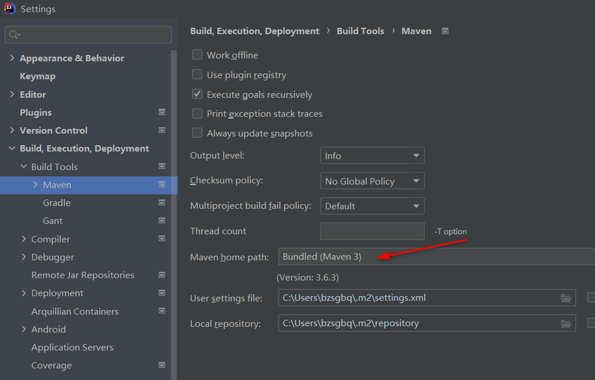
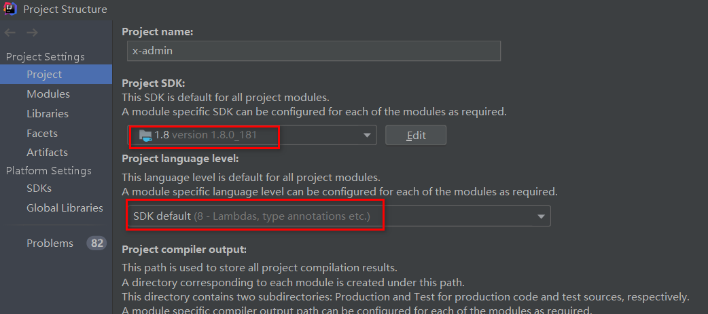
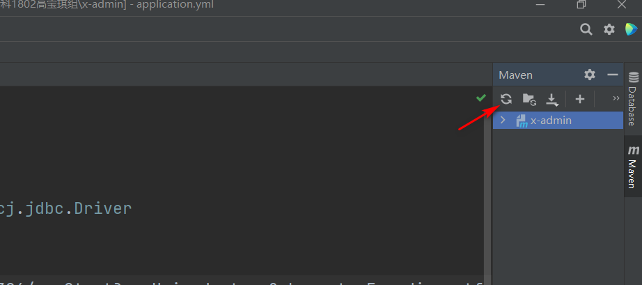
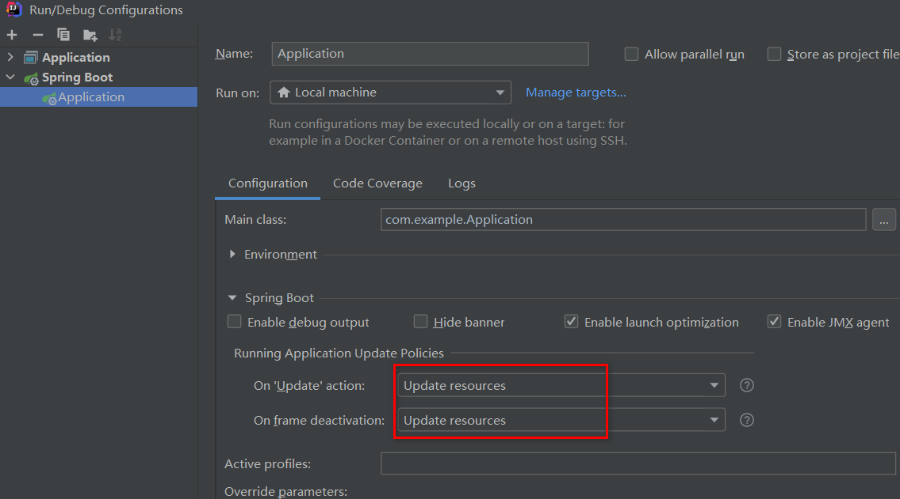
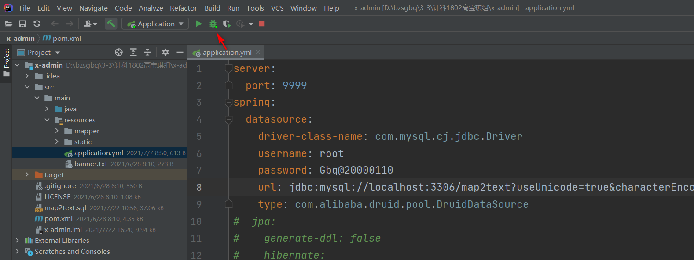
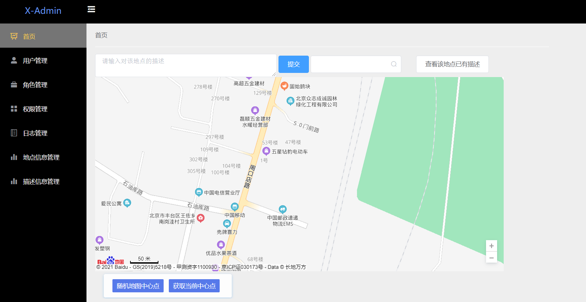

# ReadMe

#### 配置过程

打开IDEA:

1. File -> Setting -> 搜索Maven -> Bundied (Maven 3) 

   

   

2. FIle -> project structure -> project ->jdk1.8 ,  下面的框选8-...

   

   

3. 刷新Maven -> Application -> Edit Configurations -> 两个update resourses

     

     

     

4. 在项目的application.yml 文件中, 改成你的数据库用户名和密码: 
     username: (数据库用户名)
     password: (数据库密码)

打开Navicat

新建一个map2text的数据库, 运行项目文件夹下的map2text.sql

点击idea中的小虫, Debug项目

进入网址: http://localhost:9999/page/end/login.html

用户名: admin   密码: admin

即可享用系统;

